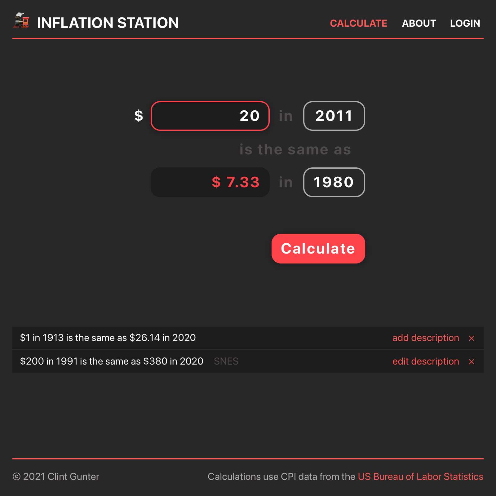

# Inflation Station

A full revision of this project is [in development](https://github.com/futureclint/inflation-station-2).

- Deployed front-end: <a href="https://inflation-station.netlify.app" target="_blank">https://inflation-station.netlify.app</a>
- Deployed back-end: <a href="https://inflation-station.herokuapp.com" target="_blank">https://inflation-station.herokuapp.com</a>

## Overview

Inflation Station is an inflation calculator that allows users to calculate inflation. Calculations are saved as entries which can then have optional descriptions added to them or deleted.

## MVP

> The Minimum Viable Product should be a well-planned, easily-communicated product, ensuring that the client's deliverable will be achievable and meet specifications within the time frame estimated.

The Inflation Station MVP contains the basic functionality to calculate inflation between the years CPI data is available: 1913–2021, save entries, edit descriptions of entries, and delete entries.

## Libraries and Dependencies

|     Library      | Description                                |
| :--------------: | :----------------------------------------- |
| Ruby on Rails    | Data models, RESTful JSON endpoints        |
| PostgreSQL       | Database                                   |
| React            | Front-end components                       |
| React Router     | Client-side routing                        |

## Wireframe



## Component Tree


## ERD


## Time Estimates

| Task                | Priority | Estimated Time | Actual Time   |
| ------------------- | :------: | :------------: | :-----------: |
| Set up back-end     | H        |     10 hrs     |     15 hrs    |
| Set up front-end    | M        |     10 hrs     |     12 hrs    |
| Set up CRUD actions | H        |     10 hrs     |     20 hrs    |
| Styling             | L        |     4 hrs      |     6 hrs     |
| Deployment          | H        |     1 hr       |     1 hr      |
| TOTAL               |          |     35 hrs     |     54 hrs    |

## Code Showcase

The algorithm to calculate inflation is contained within the POST entry method on the back-end:

```
# POST /entries
def create
  @entry = Entry.new(entry_params)
  @entry.user = @current_user

  # Retrieve starting and ending average CPI values by starting/end yaer
  @starting_datum = CpiDatum.find_by(year: @entry.starting_year).avg_cpi
  @ending_datum = CpiDatum.find_by(year: @entry.ending_year).avg_cpi

  # If starting year is before ending year: starting_value * ( ending_CPI / starting_CPI )
  # Else if starting year is after ending year: starting_value * ( starting_CPI / ending_CPI )
  # Else if they are equal, just make ending value equal to the starting value
  if @entry.starting_year < @entry.ending_year
    @entry.ending_value = (@entry.starting_value * ( @ending_datum / @starting_datum )).round(2)
  elsif @entry.starting_year > @entry.ending_year
    @entry.ending_value = (@entry.starting_value * ( @starting_datum / @ending_datum)).round(2)
  else
    @entry.ending_value = @entry.starting_value.round(2)
  end

  if @entry.save
    render json: @entry, status: :created
  else
    render json: @entry.errors, status: :unprocessable_entity
  end
end
```

## Code Issues & Resolutions

One challenge that occurred was how to handle the editing of multiple entries on the same page. By default, all entries were receiving the same state from any input that was typed in. This problem was solved by putting each entry in its own component, and discreetly handling that state there.

Another challenging bug was all users could see all entries created by all users. This occurred because there was no logic to only display an entry if the `user_id` matched up with the `id` of `currentUser`, so the problem was solved by passing `currentUser` down into where each entry was rendered, then adding logic to conditionally render an entry only if it is an entry owned by the current user.

## Post-MVP

The biggest post-MVP goal is to refine and polish the styling of the app to match the design of the wireframe. Functionality to make the calculate form work, but not save, when a user is not logged in is crucial as well. An about page and some explanatory text above the form are needed to inform the user how to use the tool, and why it exists.
